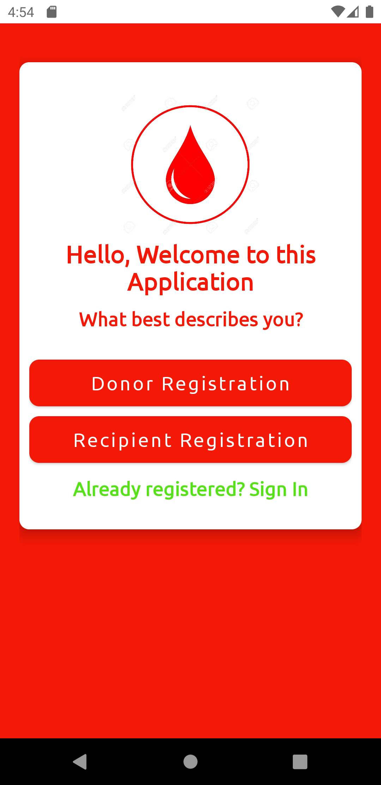
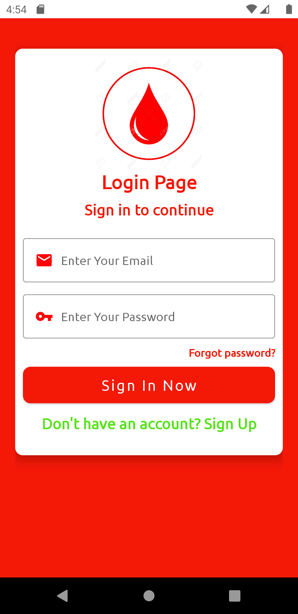
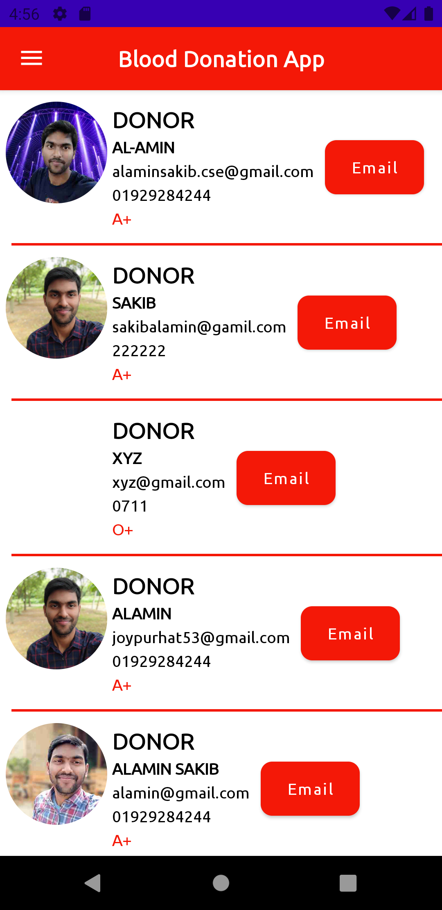

## General

Blood Donation App Using Firebase

<a id="raw-url" href="apk/Blood Donation App.apk?raw=true">
</a>


## Screenshots

|                                       Registration                |                            Log In                            |                            Donor                             |
| :------------------------------------------------------------------: | :-----------------------------------------------------------------: | :------------------------------------------------------------------: |
|   |  |   |  


## Dependencies 

- Firebase Dependencies

```
implementation 'com.google.firebase:firebase-auth:21.0.1'
implementation 'com.google.firebase:firebase-database:20.0.3'
implementation 'com.google.firebase:firebase-storage:20.0.0'
implementation 'com.google.firebase:firebase-firestore:24.0.1'
testImplementation 'junit:junit:4.+'
```
- E-mail Send Dependencies
```
implementation files('libs/activation.jar')
implementation files('libs/additionnal.jar')
implementation files('libs/mail.jar')
```

- Others Dependencies
```
implementation 'de.hdodenhof:circleimageview:3.1.0'
implementation 'com.github.bumptech.glide:glide:4.12.0'
annotationProcessor 'com.github.bumptech.glide:compiler:4.12.0'
implementation 'com.squareup.picasso:picasso:2.71828'
```